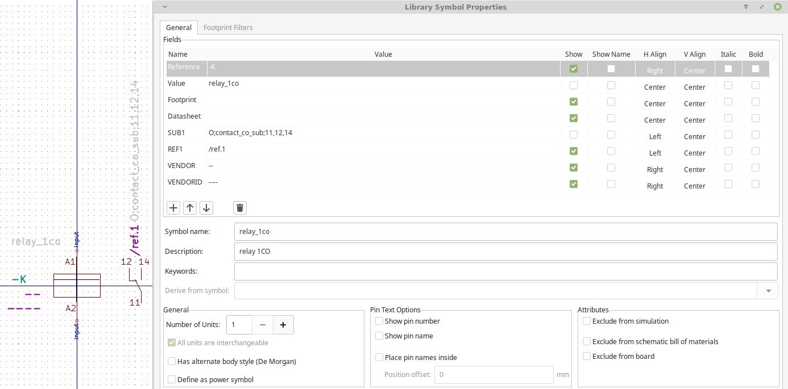
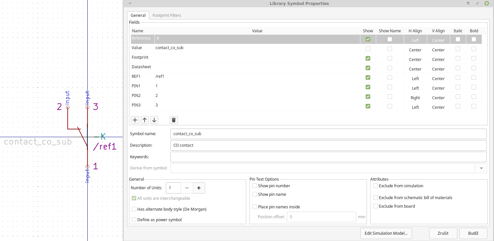

[< BACK](../README.md)

# Library Symbols

> Preparing...

In the electric diagrams is necessary to have divided one functional part into several logic componenet placed around whole diagram. 

One example could be the relay, it's coil shall be placed near some inputs. Otherwise, the contact of the relay shall be placed somewhere near to the outputs. It is necessary to place a link between them for orientation in the paper-printed diagram. 

Second example could be complex programable logic controller (PLC). Typically, the basis of the PLC is located on one sheet together with similar devices, and inputs / outputs are located somewhere on other sheets in diagram.

To deal with this functionality KIPE uses the fields located in each symbol / library of the symbols. There are no relevant fields defined by default, so the "user defined" fields has to be used / introduced for each symbol.

For the next description, lets introduce the naming convention:
* __root symbol__ - main part of the device, mandatory, shall be used everytime (eg. coil of the relay). There is only 1 root symbol for one device.
* __sub symbol__ - secondary part of the device, could be mandatory / optional for the device (eg. contact of the relay). There could be many sub symbol for one device.

## Root symbol - creating user defined fiels

There shall be defined user fields in each root symbol:
* __SUBx__ - Description of the sub symbol, where x=1..99 (eg. REF1, REF2 etc.) The value of the REFx gives all necessary information divided by ```;``` about the symbol:
  * if the symbol is mandatory ```M``` or optional ```O```
  * the name of the sub symbol in library. The regular expression could be used.
  * the list of __PINx__ in the sub symbol. eg. if there is list of 5,6,7 - there will be set values for each __PINx__ field in subsymbol, so PIN1=5, PIN2=6, PIN3=7
  
  Example:
  ```
  M;contact_co_cub;12,13,14
  ```
  Meas there shall be ```M``` placed sub symbol ```contact_co_sub``` and the pins of the sub symbol shall be set to ```12,13,14``` by KIPE.  
* __REFx__ - Location of the sub symbol, where x=1..99 (eg. REF1, REF2 etc.) The vlue of the __REFx__ shall be set as location of the sub symbol by KIPE.
* __VENDOR__ - Vendor of the device, mandatory for BOM purposes.
* __VENDORID__ - means the type of the device, manufacturer id etc. Mandatory for BOM purposes.

    
    
## Sub symbol - creating user defined fiels

There shall be defined user fields in each sub symbol:
* __REF1__ - Location of the root symbol. The value of the field __REF1__ shall be set by KIPE.
* __PINx__ - Defines pin number to change (if needed) as defined in the root symbol.

    
    
# Illustration
Lets have the relay in the diagram. We placed the 2 symbols in the sheet (one is root symbol, second is sub symbol) and set their references manually to -K1 for the root symbol and -K1.1 for the subsymbol. By the manual setting of the references, we have created the "link between" root and sub symbol. See figure below:
 

Now, we saved the diagram and closed KiCad. Now we have to load KiCad project file into KIPE ```load test.kicad_pro``` run KIPE command ```mksubs``` and ```save``` the result. 

Run in commandline:
```
python3 kipe.py load test.kicad_pro mksubs save
```
We have got result:
```
Loading project... OK
Checking and creating references to subsymbols... OK
Saving project... OK
```
And after opening diagram in KiCad again, we have (see also figure below):
* filled the location reference /2.A1 /2.A2 for root and sub symbols
* PIN number on the sub symbol is rewritten from the settings in the root symbol
